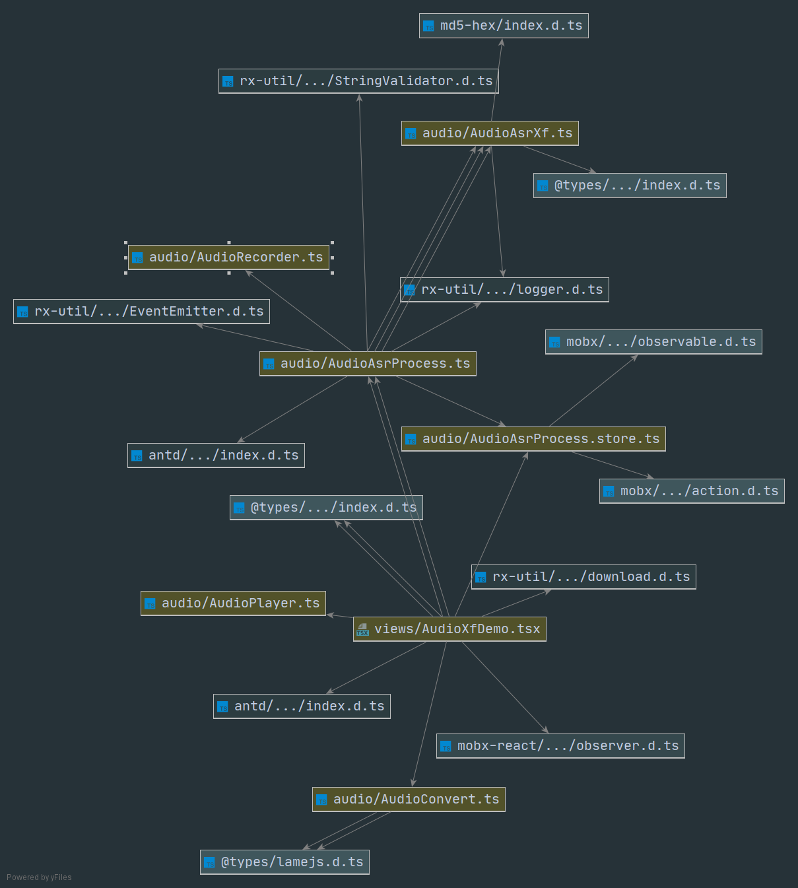

# 【React+TS】集成讯飞实时语音听写/实时语音转写的 Demo

## 介绍

在业务中用到了讯飞的一些服务，但因为价格原因公司决定弃用，故而将部分 demo 的代码分享出来，内部实现了一些简单的封装，方便后面其他人继承讯飞的上面两个服务时少走弯路。

## 主要代码关系

- `AudioAsrProcess.store.ts`: 全局存储的数据，便于在纯逻辑层操作
- `AudioAsrProcess.ts`: 最终整合讯飞和音频相关代码暴露出来的接口
- `AudioAsrXf.ts`: 讯飞识别相关代码
- `AudioRecorder.ts`: 音频记录相关代码
- `AudioConvert.ts`: 工具类：音频转换相关代码
- `AudioPlayer.ts`: 工具类：音频播放相关代码



## 主要使用方式

配置 `AppId/AppKey/apiSecret`，具体配置位置在 `AudioAsrProcess.xfAppConfig`。

```ts
const audioAsrProcess = new AudioAsrProcess();
//开始语音识别
audioAsrProcess.start();
//开始语音识别
audioAsrProcess.stop();
```

## 其他功能

转换为 mp3

```ts
let blob = AudioConvert.float32ArrayToMp3(
  audioAsrProcess.audioRecorder.dataList
);
```

播放 mp3

```ts
new AudioPlayer(URL.createObjectURL(blob)).play();
```

下载 mp3

```ts
download(blob, "录制的音频.mp3");
```
